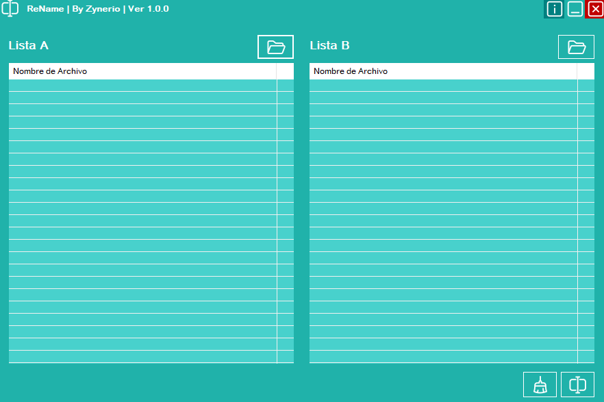

# ReName

ReName es una utilidad de escritorio desarrollada en VB.NET para el renombrado masivo y eficiente de archivos, diseñada para facilitar la organización de grandes colecciones de datos.

## Descripción

Esta aplicación permite tomar una lista de nombres base (Lista A) y aplicarlos a un conjunto de archivos existentes (Lista B), preservando automáticamente las extensiones originales de los archivos destino. Es ideal para estandarizar nombres de archivos basándose en listados limpios.

## Características Principales

- **Interfaz Intuitiva**: Dos paneles principales (Lista A y Lista B) para visualizar claramente el origen de los nombres y los archivos destino.
- **Drag & Drop**: Soporte completo para arrastrar y soltar archivos o carpetas directamente sobre las listas.
- **Selección Flexible**: 
  - Carga de carpetas completas.
  - Selección de múltiples archivos individuales.
  - Menú contextual en botones de carga para elegir método.
- **Sincronización Visual**: Al seleccionar un ítem en una lista, se resalta automáticamente el correspondiente en la otra para verificar la alineación.
- **Renombrado Inteligente**:
  - Preserva la extensión original del archivo de la Lista B.
  - Valida que el número de elementos en ambas listas coincida.
  - Detecta y omite archivos que ya tienen el nombre correcto.
  - Previene errores por caracteres inválidos.
- **Gestión de Listas**:
  - Botón de limpieza total (Clear) para vaciar ambas listas.
  - Eliminación individual de ítems con la tecla `Suprimir`.
- **Seguridad y Logs**:
  - Confirmación antes de realizar cambios masivos.
  - Registro detallado de operaciones en `operations.log`.
  - Sistema de alertas visuales personalizado.

## Requisitos del Sistema

- Sistema Operativo: Windows 7/8/10/11
- Framework: .NET Framework 4.8.1 o superior

## Uso

1. **Cargar Nombres (Lista A)**: Arrastra archivos o usa el botón izquierdo para cargar los archivos que contienen los nombres deseados (o simplemente una lista de archivos "modelo").
2. **Cargar Archivos a Renombrar (Lista B)**: Arrastra los archivos que deseas modificar al panel derecho.
3. **Verificar**: Asegúrate de que el orden de los archivos en ambas listas esté alineado correctamente. Puedes borrar ítems incorrectos con `Suprimir`.
4. **Renombrar**: Haz clic en el botón central de renombrado. Confirma la operación y revisa el resultado.

https://youtu.be/b-fPwl4lBEg

## Autor

Desarrollado por Zynerio.
